<div id="header" align="center">
    
</div>


---
### 👩‍💻: About Me :
```node
#SPDX-License-Identifier: MIT
pragma npm ^3.10.1
class Profile {
    constructor() {
        this.name = "Duong Thanh Phu";
        this.jobTitle = "Back-End Developer";
        this.country = "Viet Nam";
        this.currentlyWorking = ["Java", "Javascript", "Restful Api"];
        this.currentlyLearning = ["Advanced Spring Boot"];
    }

    getSkills() {
        let skills = ["Java", "PHP", "Laravel", "Js", "C/C++", "HTML & CSS"];
        return skills;
    }
}

const myProfile = new Profile();
console.log("Name:", myProfile.name);
console.log("Job Title:", myProfile.jobTitle);
console.log("Country:", myProfile.country);
console.log("Currently Working:", myProfile.currentlyWorking);
console.log("Currently Learning:", myProfile.currentlyLearning);
console.log("Skills:", myProfile.getSkills());
```


---



---


### :hammer_and_wrench: Languages and Tools :
<div align="center">
 
 
  
  
  
  
  
  
  
  
  
  
  
  
  
</div>

---
